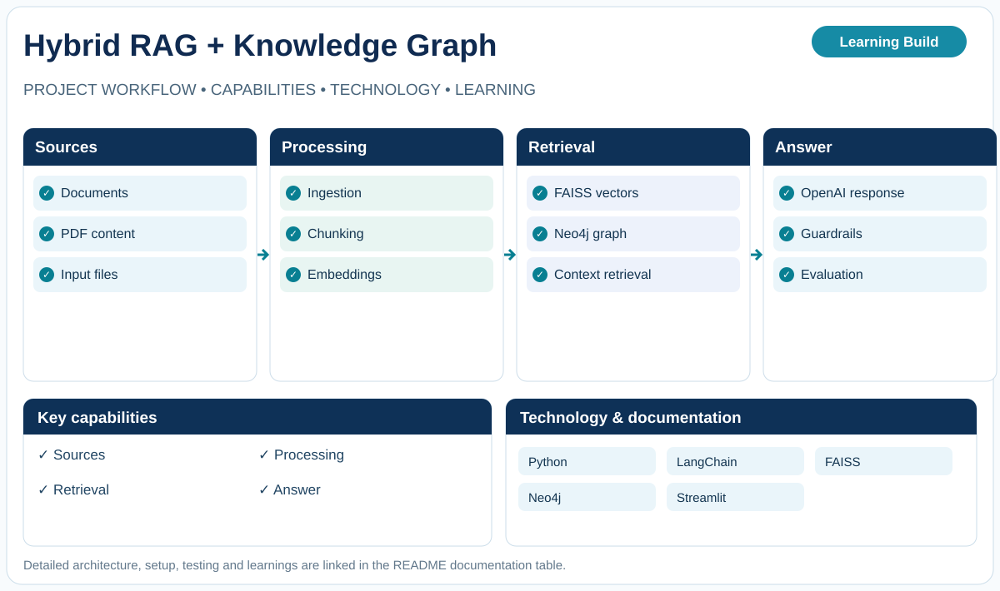

# Hybrid RAG — FAISS + Neo4j

**Learning Build · Retrieval and knowledge graphs**

Document ingestion and evidence-grounded retrieval exploration.

## What this project explores

- Document ingestion
- Vector search with FAISS
- Graph context with Neo4j
- Response generation
- Guardrails and evaluation

## Technology

Python · LangChain · FAISS · Neo4j · Streamlit

## Documentation

- [PROJECT GUIDE](docs/PROJECT-GUIDE.md)

## Scope

This repository documents a hands-on build and its engineering learnings. See the linked project guide for implementation details, setup, testing, and any deployment notes. Features and results should be interpreted within the documented project scope.
